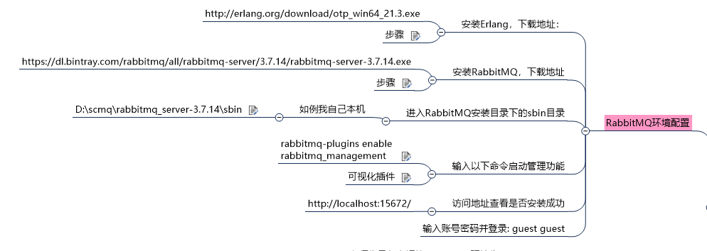
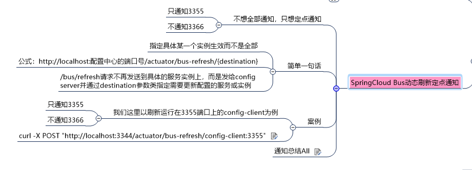
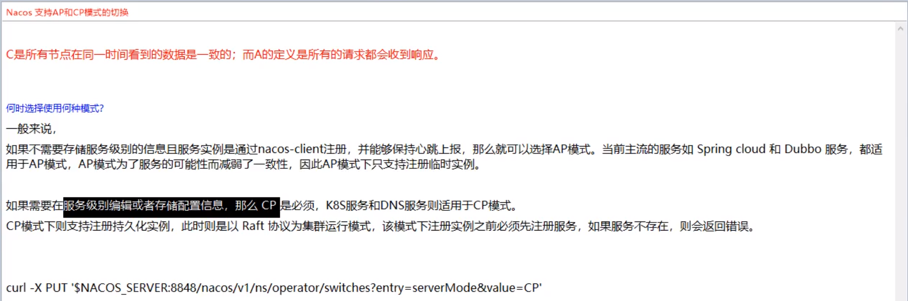
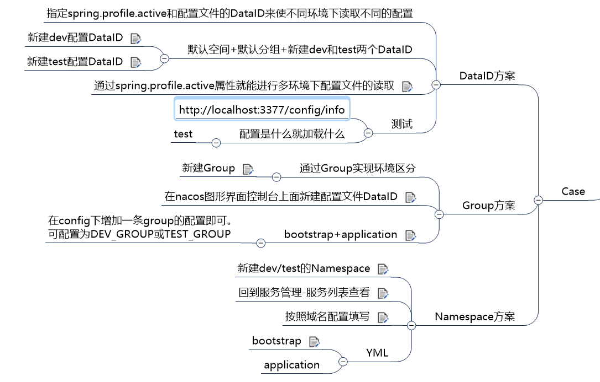

## 基础篇------Spring boot回顾篇
* tag: [v1.0.0.1](https://github.com/kleinlsl/cloud2020/releases/tag/v1.0.0.1)
* P1---P14
* time:2020/11/30 - 16:39

| 模块                                                      | 描述                   |
| --------------------------------------------------------- | ---------------------- |
| [cloud-api-commons](/cloud-api-commons)                   | 工程重构--抽取公共组件 |
| [cloud-consumer-order80](/cloud-consumer-order80)         | 消费者订单模块         |
| [cloud-provider-payment8001](/cloud-provider-payment8001) | 支付模块               |

## Eureka部分
* tag: [v1.0.0.2](https://github.com/kleinlsl/cloud2020/releases/tag/v1.0.0.2)
* P15---P27 
* time:2020/12/1 - 10:00

| 模块                                                      | 描述                   | 更改记录       |
| --------------------------------------------------------- | ---------------------- | -------------- |
| [cloud-api-commons](/cloud-api-commons)                   | 工程重构--抽取公共组件 | ----           |
| [cloud-consumer-order80](/cloud-consumer-order80)         | 消费者订单模块         | 添加eureka部分 |
| [cloud-provider-payment8001](/cloud-provider-payment8001) | 支付模块：payment8001  | 添加eureka部分 |
| [cloud-provider-payment8002](/cloud-provider-payment8002) | 支付模块：payment8002  |                |
| [cloud-eureka-server7001](/cloud-eureka-server7001)       | eureka服务端：7001     |                |
| [cloud-eureka-server7002](/cloud-eureka-server7002)       | eureka服务端：7002     |                |

## Zookeeper部分
* tag: [v1.0.0.3](https://github.com/kleinlsl/cloud2020/releases/tag/v1.0.0.3)
* P28---P30   
* time:2020/12/1 - 11:32
* [Ubuntu使用Docker安装zookeeper](/cloud-provider-payment8004)

| 模块                                                      | 描述       | 更改记录 |
| --------------------------------------------------------- | ---------- | -------- |
| [cloud-provider-payment8004](/cloud-provider-payment8004) | 服务提供者 | ----     |
| [cloud-consumerzk-order80](/cloud-consumerzk-order80)     | 服务消费者 | ----     |

## Consul部分

* tag：[v1.0.0.4](https://github.com/kleinlsl/cloud2020/releases/tag/v1.0.0.4)
* P31---P35
* time：2020/12/1 - 14:16

| 模块                                                         | 描述             | 更改记录 |
| ------------------------------------------------------------ | ---------------- | -------- |
| [cloud-provider-consul-payment8006](/cloud-provider-consul-payment8006) | consul服务提供者 | ----     |
| [cloud-consumer-consul-order80](/cloud-consumer-consul-order80) | consul服务消费者 | ----     |

* 三个注册中心的异同点

| 组件名    | 语言 | CAP  | 服务健康检查 | 对外暴露接口 | SpringCloud集成 |
| --------- | ---- | ---- | ------------ | ------------ | --------------- |
| Eureka    | Java | AP   | 可配支持     | HTTP         | 集成            |
| Consul    | GO   | CP   | 支持         | HTTP/DNS     | 集成            |
| Zookeeper | Java | CP   | 支持         | 客户端       | 集成            |

## Ribbon部分

* tag：[v1.0.0.5](https://github.com/kleinlsl/cloud2020/releases/tag/v1.0.0.5)
* P36---P42
* time：2020/12/1 - 16:22

| 模块                                                      | 描述           | 更改记录           |
| --------------------------------------------------------- | -------------- | ------------------ |
| [cloud-consumer-order80](/cloud-consumer-order80)         | 消费者订单模块 | 添加自定义轮询算法 |
| [cloud-provider-payment8001](/cloud-provider-payment8001) | 服务提供者8001 | 添加测试轮询的接口 |
| [cloud-provider-payment8002](/cloud-provider-payment8002) | 服务提供者8002 | 添加测试轮询的接口 |

## OpenFeign部分

* tag：[v1.0.0.6](https://github.com/kleinlsl/cloud2020/releases/tag/v1.0.0.6)
* P43---P46
* time：2020/12/2 - 9:55

| 模块                                                         | 描述           | 更改记录     |
| ------------------------------------------------------------ | -------------- | ------------ |
| [cloud-consumer-feign-order80](/cloud-consumer-feign-order80) | 消费者订单模块 | ----         |
| [cloud-provider-payment8001](/cloud-provider-payment8001)    | 服务提供者8001 | 添加超时接口 |
| [cloud-provider-payment8002](/cloud-provider-payment8002)    | 服务提供者8002 | 添加超时接口 |

## Hystrix部分

* tag：[v1.0.0.7](https://github.com/kleinlsl/cloud2020/releases/tag/v1.0.0.7)
* P47---P64
* time：2020/12/2 - 15:25

| 模块                                                         | 描述                  | 更改记录 |
| ------------------------------------------------------------ | --------------------- | -------- |
| [cloud-provider-hystrix-payment8001](/cloud-provider-hystrix-payment8001) | hystrix服务提供者模块 | ----     |
| [cloud-consumer-feign-hystrix-order80](/cloud-consumer-feign-hystrix-order80) | hystrix消费者服务模块 | ----     |
| [cloud-consumer-hystrix-dashboard9001](/cloud-consumer-hystrix-dashboard9001) | hystrix仪表盘监控服务 | ----     |

## GateWay 网关
* tag：[v1.0.0.8](https://github.com/kleinlsl/cloud2020/releases/tag/v1.0.0.8)
* P65---P73
* time：2020/12/3 - 11:17

| 模块                                                    | 描述            | 更改记录 |
| ------------------------------------------------------- | --------------- | -------- |
| [cloud-gateway-gateway9527](/cloud-gateway-gateway9527) | GateWay服务网关 | ----     |

## SpringCloud config分布式配置中心
* tag：[v1.0.0.9](https://github.com/kleinlsl/cloud2020/releases/tag/v1.0.0.9)
* P74---P77
* time：2020/12/3 - 14:26

| 模块                                                  | 描述                                   | 更改记录 |
| ----------------------------------------------------- | -------------------------------------- | -------- |
| [cloud-config-center-3344](/cloud-config-center-3344) | SpringCloud config分布式配置中心服务端 | ----     |
| [cloud-config-client-3355](/cloud-config-client-3355) | SpringCloud config分布式配置中心客户端 | ----     |

## SpringCloud Bus 消息总线部分
* tag：[v1.0.0.10](https://github.com/kleinlsl/cloud2020/releases/tag/v1.0.0.10)
* P78---P82
* time：2020/12/3 - 16:06

| 模块                                                  | 描述                                       | 更改记录               |
| ----------------------------------------------------- | ------------------------------------------ | ---------------------- |
| [cloud-config-center-3344](/cloud-config-center-3344) | SpringCloud config分布式配置中心服务端     | 添加消息总线和RabbitMQ |
| [cloud-config-client-3355](/cloud-config-client-3355) | SpringCloud config分布式配置中心客户端3355 | 添加消息总线和RabbitMQ |
| [cloud-config-client-3366](/cloud-config-client-3366) | SpringCloud config分布式配置中心客户端3366 | 添加消息总线和RabbitMQ |

## SpringCloud Stream 消息驱动部分
* tag：[v1.0.0.11](https://github.com/kleinlsl/cloud2020/releases/tag/v1.0.0.11)
* P83---P91
* time：2020/12/8 - 10:28

| 模块                                                         | 描述                                      | 更改记录 |
| ------------------------------------------------------------ | ----------------------------------------- | -------- |
| [cloud-stream-rabbitmq-provider8801](/cloud-stream-rabbitmq-provider8801) | SpringCloud Stream Rabbitmq消息提供者     | -----    |
| [cloud-stream-rabbitmq-consumer8802](/cloud-stream-rabbitmq-consumer8802) | SpringCloud Stream Rabbitmq消息消费者8802 | -----    |
| [cloud-stream-rabbitmq-consumer8803](/cloud-stream-rabbitmq-consumer8803) | SpringCloud Stream Rabbitmq消息消费者8803 | -----    |

## SpringCloud Sleuth分布式请求链路追踪
* tag：[v1.0.0.12](https://github.com/kleinlsl/cloud2020/releases/tag/v1.0.0.12)
* P92---P94
* time：2020/12/8 - 11:18

| 模块                                                      | 描述               | 更改记录                     |
| --------------------------------------------------------- | ------------------ | ---------------------------- |
| [cloud-consumer-order80](/cloud-consumer-order80)         | SpringCloud 消费者 | 添加Sleuth分布式请求链路跟踪 |
| [cloud-provider-payment8001](/cloud-provider-payment8001) | SpringCloud 生产者 | 添加Sleuth分布式请求链路跟踪 |

---

**以下为SpringCloud 高级篇内容**

---
## SpringCloud Alibaba Nacos服务注册和配置中心

### SpringCloud Alibaba Nacos服务注册中心

* tag：[v1.0.0.13.1](https://github.com/kleinlsl/cloud2020/releases/tag/v1.0.0.13.1)
* P95---P100
* time：2020/12/8 - 14:41

| 模块                                                         | 描述             | 更改记录 |
| ------------------------------------------------------------ | ---------------- | -------- |
| [cloudalibaba-consumer-nacos-order83](/cloudalibaba-consumer-nacos-order83) | nacos 消费者     | -----    |
| [cloudalibaba-provider-payment9001](/cloudalibaba-provider-payment9001) | nacos 生产者9001 | -----    |
| [cloudalibaba-provider-payment9002](/cloudalibaba-provider-payment9002) | nacos 生产者9002 | -----    |

### SpringCloud Alibaba Nacos服务配置中心

* tag：[v1.0.0.13.2](https://github.com/kleinlsl/cloud2020/releases/tag/v1.0.0.13.2)
* P101---P105
* time：2020/12/8 - 16:02

| 模块                                                         | 描述                                  | 更改记录 |
| ------------------------------------------------------------ | ------------------------------------- | -------- |
| [cloudalibaba-config-nacos-client3377](/cloudalibaba-config-nacos-client3377) | SpringCloud Alibaba Nacos服务配置中心 | -----    |

### Nacos集群和持久化配置(重要)

* tag：[v1.0.0.13.3](https://github.com/kleinlsl/cloud2020/releases/tag/v1.0.0.13.3)
* P106---P110
* time：2020/12/9 - 13:50
* 参考博客：[here](https://blog.csdn.net/ma_508346117/article/details/108814532)

| 模块                                                         | 描述                                | 更改记录      |
| ------------------------------------------------------------ | ----------------------------------- | ------------- |
| [cloudalibaba-provider-payment9002](/cloudalibaba-provider-payment9002) | SpringCloud Alibaba Nacos服务提供者 | 修改nacos地址 |

## SpringCloud Alibaba Sentinel实现熔断与限流

* tag：[v1.0.0.14](https://github.com/kleinlsl/cloud2020/releases/tag/v1.0.0.14)
* P111---P137
* time：2020/12/10 - 11:53

| 模块                                                         | 描述                         | 更改记录                                                     |
| ------------------------------------------------------------ | ---------------------------- | ------------------------------------------------------------ |
| [cloudalibaba-sentinel-service8401](/cloudalibaba-sentinel-service8401) | SpringCloud Alibaba Sentinel | add Sentinel 1、流控规则 2、降级规则 3、热点key规则 4、系统规则 |

| 模块                                                         | 描述                         | 更改记录           |
| ------------------------------------------------------------ | ---------------------------- | ------------------ |
| [cloudalibaba-sentinel-service8401](/cloudalibaba-sentinel-service8401) | SpringCloud Alibaba Sentinel | add 按资源名称限流 |

| 模块                                                         | 描述                         | 更改记录          |
| ------------------------------------------------------------ | ---------------------------- | ----------------- |
| [cloudalibaba-sentinel-service8401](/cloudalibaba-sentinel-service8401) | SpringCloud Alibaba Sentinel | add 按Url地址限流 |

| 模块                                                         | 描述                         | 更改记录                   |
| ------------------------------------------------------------ | ---------------------------- | -------------------------- |
| [cloudalibaba-sentinel-service8401](/cloudalibaba-sentinel-service8401) | SpringCloud Alibaba Sentinel | add 客户自定义限流处理逻辑 |

| 模块                                                         | 描述                           | 更改记录                             |
| ------------------------------------------------------------ | ------------------------------ | ------------------------------------ |
| [cloudalibaba-consumer-nacos-order84](/cloudalibaba-consumer-nacos-order84) | SpringCloud Alibaba 消费者     | add Sentinel服务熔断功能之Ribbon系列 |
| [cloudalibaba-provider-payment9003](/cloudalibaba-provider-payment9003) | SpringCloud Alibaba 生产者9003 | add Sentinel服务熔断功能之Ribbon系列 |
| [cloudalibaba-provider-payment9004](/cloudalibaba-provider-payment9004) | SpringCloud Alibaba 生产者9004 | add Sentinel服务熔断功能之Ribbon系列 |

| 模块                                                         | 描述                       | 更改记录                            |
| ------------------------------------------------------------ | -------------------------- | ----------------------------------- |
| [cloudalibaba-consumer-nacos-order84](/cloudalibaba-consumer-nacos-order84) | SpringCloud Alibaba 消费者 | add Sentinel服务熔断功能之Feign系列 |

| 模块                                                         | 描述                         | 更改记录                            |
| ------------------------------------------------------------ | ---------------------------- | ----------------------------------- |
| [cloudalibaba-sentinel-service8401](/cloudalibaba-sentinel-service8401) | SpringCloud Alibaba Sentinel | add Sentinel规则持久到Nacos配置中心 |
